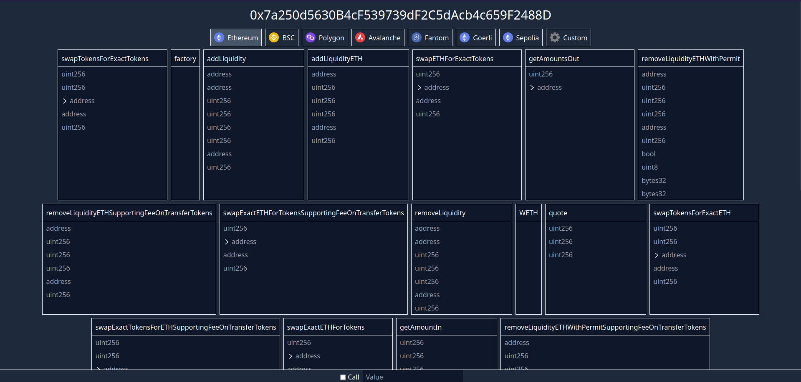

# [Etheract](https://etheract.vercel.app/)
Etheract allows to easily interact with any Solidity or Vyper contract with a simple UI. No source code or ABI is needed.

Available for Ethereum, BSC, Polygon, Avalanche, Fantom, Goerli, Sepolia and custom chains.



## How it works
Every Ethereum function is represented by its signature which corresponds to the first 4 bytes of the keccak256 hash of `functionName(param1,param2,...)` (e.g. the signature of `function approve(address spender, uint256 amount)` is `095ea7b3`).

Going from the signature to the original function name and parameters is only possible by storing them in a lookup table (or database).

### Jump table
Every contract's bytecode contains a jump table which tries to jump to a particular function depending on the signature. This is similar to a switch statement

e.g. 
```ts
switch(signature) {
    case "095ea7b3": {
        //Jump to corresponding function
    }
    ...
}
```

Etheract finds function signatures by skimming through the jump table using regular expressions.
- Solidity function signatures are preceded by `8063` (DUP1, PUSH4) opcodes
- Vyper function signatures are contained between `005b63` and `600051141561` opcodes

These signatures are then matched to their corresponding function by querying the database, which can be parsed to find the parameters.

## Signature database
- [Ethereum Signature Database](https://sig.eth.samczsun.com/) by samczsun
